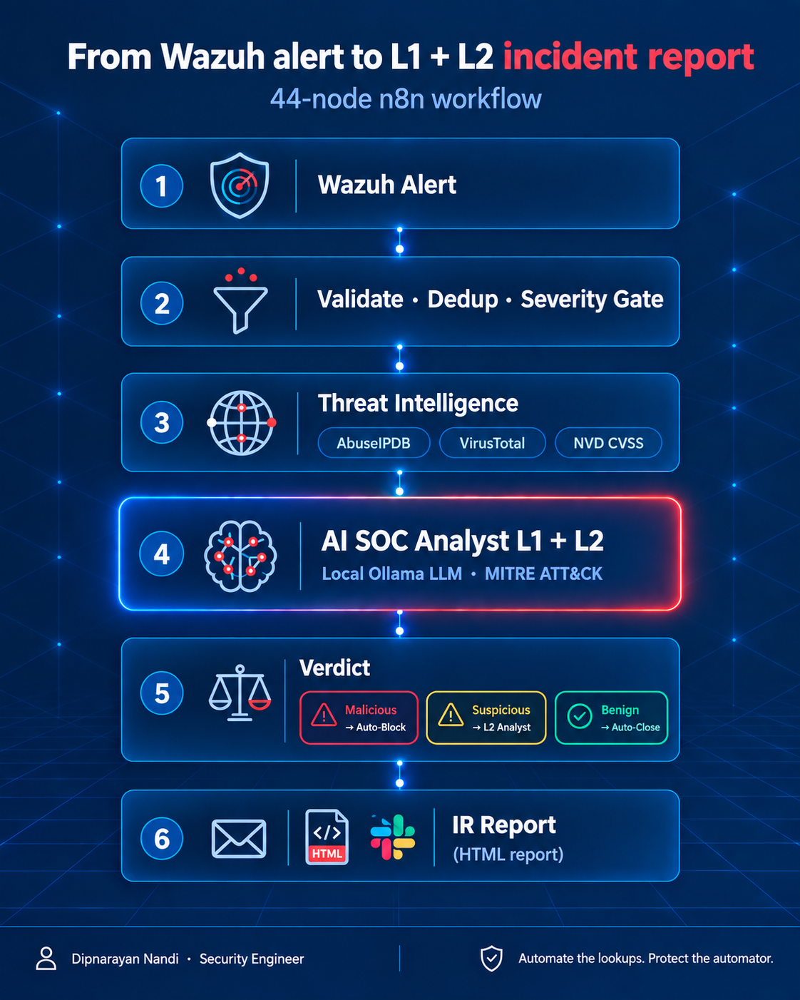
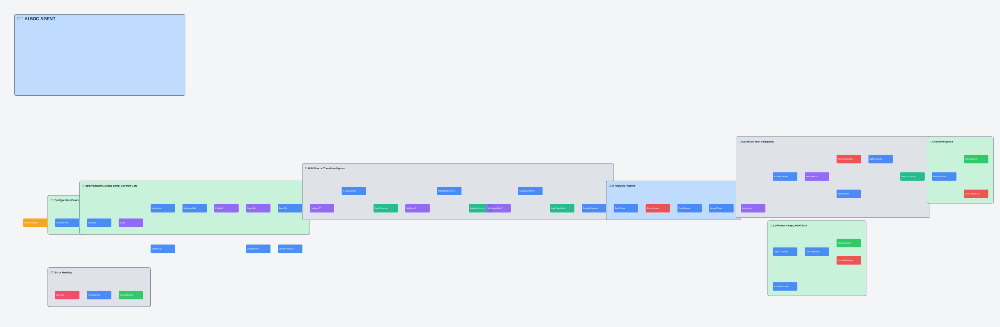

<div align="center">



# AI SOC Agent

**A 44-node n8n workflow that triages Wazuh alerts like an L1/L2 SOC analyst —**
**IP reputation & geo, CVSS/vulnerability lookup, malware analysis, local-LLM**
**verdict + MITRE mapping, safeguarded auto-block, and a color-coded IR report.**

[](LICENSE)
[](https://n8n.io)
[](https://wazuh.com)
[-000000)](https://ollama.com)
[](CONTRIBUTING.md)

</div>

---

## How it works

Wazuh generates alerts. A human SOC analyst normally has to open five browser
tabs — AbuseIPDB, VirusTotal, NVD, MITRE ATT&CK, and the ticketing tool — just
to decide whether one alert matters. This workflow automates that first pass:

1. **Wazuh Alert** arrives via webhook
2. **Validate · Dedup · Severity Gate** — drop noise before it costs anything
3. **Threat Intelligence** — AbuseIPDB + geolocation, VirusTotal, NVD/CVSS
4. **AI SOC Analyst (L1 + L2)** — a local Ollama model produces a verdict,
   confidence score, MITRE ATT&CK mapping, business impact, and next steps —
   as strict JSON, not free text
5. **Verdict routing** — `malicious` → safeguarded auto-block, `suspicious` →
   L2 review queue, `benign` → auto-closed, no page sent
6. **IR Report** — a numbered, color-coded (Red/Blue/White) HTML report by
   email, plus a single-line Slack alert

Everything runs locally except the optional threat-intel API calls — no data
leaves your infrastructure to reach a third-party LLM.

## Screenshots

<details>
<summary><b>Workflow canvas overview</b> (click to expand)</summary>
<br>

</details>

<details>
<summary><b>Sample IR report</b> (click to expand)</summary>
<br>
Open <a href="docs/sample-ir-report-preview.html">docs/sample-ir-report-preview.html</a>
in a browser for the full rendered example (compromised host, Mirai malware,
unpatched CVE-2023-38408, severity score 90/Critical).
</details>

## Features

| | |
|---|---|
| ✅ **Input validation & dedup** | Rejects malformed alerts; rolling-window dedup so one brute-force burst doesn't fire 200 notifications |
| 🌐 **IP reputation + geo footprint** | AbuseIPDB confidence score, Tor/proxy/hosting flags, city/country/ASN via ip-api.com |
| 🦠 **Malware analysis** | VirusTotal detection ratio, threat classification, known aliases, file type |
| 🩹 **Vulnerability / CVSS** | Reads Wazuh's own vulnerability-detector data (CVE, CVSS score+vector, affected package, fix version), cross-referenced against NVD |
| 🤖 **Local AI L1+L2 analyst** | Ollama-powered verdict, confidence, kill-chain stage, MITRE ATT&CK, business impact, recommended actions — strict JSON output |
| 🚫 **Safeguarded auto-block** | See [Safeguards](#safeguards) below |
| 📊 **Composite Severity Score** | A single 0–100 score blending rule level + CVSS + AI confidence, independent of AI confidence and CVSS alone |
| 📧 **Standard-format IR report** | Numbered sections, Red/Blue/White color system (red reserved strictly for risk signals), sent as HTML email |
| 💬 **Minimal Slack alerts** | One line per alert — verdict, confidence, rule, asset, CVSS if present — full detail lives in the email |
| ⚠️ **Workflow-wide error handling** | A dedicated Error Trigger catches any node failure and pages a Slack channel |

## Safeguards

The auto-block branch is the one part of this workflow that can take action
on its own, so it's deliberately hard to trigger by accident. A block is
only executed when **every** condition below is true — otherwise the alert
is escalated to an L2 human instead, and the report records exactly which
condition stopped it:

- ❌ **Never blocks internal/private IPs** — RFC1918 ranges are hard-excluded (`SOC_INTERNAL_CIDRS`)
- ❌ **Never blocks explicitly allowlisted IPs** (`SOC_ALLOWLIST_IPS`)
- ❌ **Never blocks a critical asset** without human approval (`SOC_CRITICAL_ASSETS`)
- ❌ **Never blocks below 70% AI confidence**
- ❌ **Never blocks below the critical severity threshold** (`SOC_CRITICAL_THRESHOLD`, default rule level 12)
- 🔴 **Global kill switch** — `SOC_AUTO_BLOCK_ENABLED=false` disables auto-block entirely, pipeline still runs and escalates everything to L2
- 📝 **Every decision is logged with its reason**, whether it blocked or didn't — nothing is a silent no-op

## Repository structure

```
wazuh-n8n-ai-soc-agent/
├── workflow/
│   └── wazuh-ai-soc-agent.json      ← import this into n8n
├── integrations/
│   ├── custom-n8n-soc               ← Wazuh integratord launcher script
│   └── custom-n8n-soc.py            ← forwards Wazuh alerts to the n8n webhook
├── docs/
│   ├── SETUP_GUIDE.md               ← full install & configuration walkthrough
│   ├── sample-ir-report-preview.html
│   └── images/
├── .env.example                     ← every environment variable the workflow reads
├── CONTRIBUTING.md
├── LICENSE
└── README.md
```

## Quick start

### Prerequisites
- A running **n8n** instance (self-hosted or cloud), reachable from your Wazuh manager
- A running **Wazuh manager** (v4.x) with shell access
- **Ollama** running somewhere n8n can reach it (`ollama pull llama3.1:8b`)
- Free-tier API keys: [AbuseIPDB](https://www.abuseipdb.com/), [VirusTotal](https://www.virustotal.com/)
- Slack and/or Gmail credentials configured in n8n for notifications

### Install
```bash
git clone https://github.com/dipnarayannandi/wazuh-n8n-ai-soc-agent.git
cd wazuh-n8n-ai-soc-agent
cp .env.example .env   # fill in your values, then load them into n8n
```

1. **Import the workflow** — n8n → Workflows → Import from File →
   `workflow/wazuh-ai-soc-agent.json`
2. **Wire up credentials** — open the Slack and Gmail nodes and select/create
   your own OAuth credentials (never exported with the workflow)
3. **Install the Wazuh integration** — copy `integrations/custom-n8n-soc`
   and `integrations/custom-n8n-soc.py` to `/var/ossec/integrations/` on the
   Wazuh manager, `chmod 750`, `chown root:wazuh`, then add the
   `<integration>` block to `ossec.conf`
4. **Set environment variables** in n8n from your filled-in `.env`
5. **Restart** the Wazuh manager and send a test alert

Full step-by-step instructions, the exact `ossec.conf` XML, and a `curl`
command to dry-run the pipeline without touching real Wazuh are in
**[docs/SETUP_GUIDE.md](docs/SETUP_GUIDE.md)**.

## Configuration reference

All tunables are environment variables read by the workflow's Configuration
Center node — see [.env.example](.env.example) for the full list with
defaults (severity thresholds, auto-block kill switch, allowlists, model
name, API endpoints, notification recipients).

## Limitations

- Auto-block calls Wazuh's Active Response API by default — swap that one
  HTTP node if you use a different firewall/EDR.
- AI verdicts are only as reliable as the local model you run. Start with
  `SOC_AUTO_BLOCK_ENABLED=false` and watch it for a while before trusting it
  to act unsupervised.
- Vulnerability/CVSS enrichment only populates when Wazuh's
  vulnerability-detector module actually attaches `data.vulnerability` to an
  alert — that's a Wazuh-side capability, not something this workflow can add.
- This is a template, not a certified SOAR product. Pressure-test dedupe and
  severity thresholds against your real alert volume before relying on it.

## Contributing

Issues and PRs welcome — see [CONTRIBUTING.md](CONTRIBUTING.md). New
enrichment sources, alternate AI backends (OpenAI/Claude/Gemini), and report
design improvements are all good first contributions.

## License

[MIT](LICENSE) — use it, fork it, ship it internally, no attribution required
(though a ⭐ is always appreciated).

## Credits

Built by **[Dipnarayan Nandi](https://github.com/dipnarayannandi)** — Security Engineer.

*Automate the lookups. Protect the automator.*
